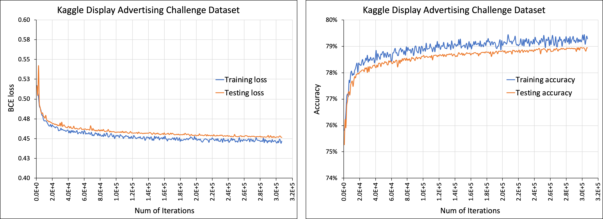

Deep Learning Recommendation Model for Personalization and Recommendation Systems:
=================================================================================
*Copyright (c) Facebook, Inc. and its affiliates.*

This readme is from the [original DLRM repository](https://github.com/facebookresearch/dlrm), with some modifications.

How to run
--------------------

0)
The code supports interface with the [Criteo Kaggle Display Advertising Challenge Dataset](https://labs.criteo.com/2014/09/kaggle-contest-dataset-now-available-academic-use/).

Please do the following to prepare the dataset for use with DLRM code:

- First, specify the raw data file (train.txt) as downloaded with `--raw-data-file=<data/train.txt>`
- This is then pre-processed (categorize, concat across days...) to allow using with dlrm code
- The processed data is stored as `*.npz` file in `<root_dir>/data/*.npz`
- The processed file `*.npz` can be used for subsequent runs with `--processed-data-file=<data/*.npz>`

Then, run with the following script.

 ```
 ./dlrm_s_criteo_kaggle.sh
 ```


1) A sample run of the code, with a tiny model is shown below
```
$ python dlrm_s_pytorch.py --mini-batch-size=2 --data-size=6
time/loss/accuracy (if enabled):
Finished training it 1/3 of epoch 0, -1.00 ms/it, loss 0.451893, accuracy 0.000%
Finished training it 2/3 of epoch 0, -1.00 ms/it, loss 0.402002, accuracy 0.000%
Finished training it 3/3 of epoch 0, -1.00 ms/it, loss 0.275460, accuracy 0.000%
```
2) A sample run of the code, with a tiny model in debug mode
```
$ python dlrm_s_pytorch.py --mini-batch-size=2 --data-size=6 --debug-mode
model arch:
mlp top arch 3 layers, with input to output dimensions:
[8 4 2 1]
# of interactions
8
...
(more lines below)
```


Description:
------------
An implementation of a deep learning recommendation model (DLRM)
The model input consists of dense and sparse features. The former is a vector
of floating point values. The latter is a list of sparse indices into
embedding tables, which consist of vectors of floating point values.
The selected vectors are passed to mlp networks denoted by triangles,
in some cases the vectors are interacted through operators (Ops).
```
output:
                    probability of a click
model:                        |
                             /\
                            /__\
                              |
      _____________________> Op  <___________________
    /                         |                      \
   /\                        /\                      /\
  /__\                      /__\           ...      /__\
   |                          |                       |
   |                         Op                      Op
   |                    ____/__\_____           ____/__\____
   |                   |_Emb_|____|__|    ...  |_Emb_|__|___|
input:
[ dense features ]     [sparse indices] , ..., [sparse indices]
```
 More precise definition of model layers:
 1) fully connected layers of an mlp

    z = f(y)

    y = Wx + b

 2) embedding lookup (for a list of sparse indices p=[p1,...,pk])

    z = Op(e1,...,ek)

    obtain vectors e1=E[:,p1], ..., ek=E[:,pk]

 3) Operator Op can be one of the following

    Sum(e1,...,ek) = e1 + ... + ek

    Dot(e1,...,ek) = [e1'e1, ..., e1'ek, ..., ek'e1, ..., ek'ek]

    Cat(e1,...,ek) = [e1', ..., ek']'

    where ' denotes transpose operation

Cite [Work](http://arxiv.org/abs/1906.00091):
```
@article{DLRM19,
  author    = {Maxim Naumov and Dheevatsa Mudigere and Hao{-}Jun Michael Shi and Jianyu Huang and Narayanan Sundaraman and Jongsoo Park and Xiaodong Wang and Udit Gupta and Carole{-}Jean Wu and Alisson G. Azzolini and Dmytro Dzhulgakov and Andrey Mallevich and Ilia Cherniavskii and Yinghai Lu and Raghuraman Krishnamoorthi and Ansha Yu and Volodymyr Kondratenko and Stephanie Pereira and Xianjie Chen and Wenlin Chen and Vijay Rao and Bill Jia and Liang Xiong and Misha Smelyanskiy},
  title     = {Deep Learning Recommendation Model for Personalization and Recommendation Systems},
  journal   = {CoRR},
  volume    = {abs/1906.00091},
  year      = {2019},
  url       = {http://arxiv.org/abs/1906.00091},
}
```

Related Work:

On the [system architecture implications](http://arxiv.org/abs/1906.03109), with DLRM as one of the benchmarks,
```
@article{ArchImpl19,
  author    = {Udit Gupta and Xiaodong Wang and Maxim Naumov and Carole{-}Jean Wu and Brandon Reagen and David Brooks and Bradford Cottel and Kim M. Hazelwood and Bill Jia and Hsien{-}Hsin S. Lee and Andrey Malevich and Dheevatsa Mudigere and Mikhail Smelyanskiy and Liang Xiong and Xuan Zhang},
  title     = {The Architectural Implications of Facebook's DNN-based Personalized Recommendation},
  journal   = {CoRR},
  volume    = {abs/1906.03109},
  year      = {2019},
  url       = {http://arxiv.org/abs/1906.03109},
}
```

On the [embedding compression techniques (for number of vectors)](https://arxiv.org/abs/1909.02107), with DLRM as one of the benchmarks,
```
@article{QuoRemTrick19,
  author    = {Hao{-}Jun Michael Shi and Dheevatsa Mudigere and Maxim Naumov and Jiyan Yang},
  title     = {Compositional Embeddings Using Complementary Partitions for Memory-Efficient Recommendation Systems},
  journal   = {CoRR},
  volume    = {abs/1909.02107},
  year      = {2019},
  url       = {https://arxiv.org/abs/1909.02107},
}
```

On the [embedding compression techniques (for dimension of vectors)](https://arxiv.org/abs/1909.11810), with DLRM as one of the benchmarks,
```
@article{MixDimTrick19,
  author    = {Antonio Ginart and Maxim Naumov and Dheevatsa Mudigere and Jiyan Yang and James Zou},
  title     = {Mixed Dimension Embeddings with Application to Memory-Efficient Recommendation Systems},
  journal   = {CoRR},
  volume    = {abs/1909.11810},
  year      = {2019},
  url       = {https://arxiv.org/abs/1909.11810},
}
```

Implementation
--------------
**DLRM PyTorch**. Implementation of DLRM in PyTorch framework:

       dlrm_s_pytorch.py

**DLRM Data**. Implementation of DLRM data generation and loading:

       dlrm_data_pytorch.py, data_utils.py

Related Work:

On the [Glow framework](https://github.com/pytorch/glow) implementation
```
https://github.com/pytorch/glow/blob/master/tests/unittests/RecommendationSystemTest.cpp
```
On the [FlexFlow framework](https://github.com/flexflow/FlexFlow) distributed implementation with Legion backend
```
https://github.com/flexflow/FlexFlow/blob/master/examples/DLRM/dlrm.cc
```

Benchmarking
------------



*NOTE: Benchmarking scripts accept extra arguments which will passed along, such as --num-batches=100 to limit the number of data samples*

Model checkpoint saving/loading
-------------------------------
During training, the model can be saved using --save-model=<path/model.pt>

The model is saved if there is an improvement in test accuracy (which is checked at --test-freq intervals).

A previously saved model can be loaded using --load-model=<path/model.pt>

Once loaded the model can be used to continue training, with the saved model being a checkpoint.
Alternatively, the saved model can be used to evaluate only on the test data-set by specifying --inference-only option.


Version
-------
0.1 : Initial release of the DLRM code

Requirements
------------
pytorch-nightly (*6/10/19*)

onnx (*optional*)

torchviz (*optional*)

License
-------
This source code is licensed under the MIT license found in the
LICENSE file in the root directory of this source tree.
